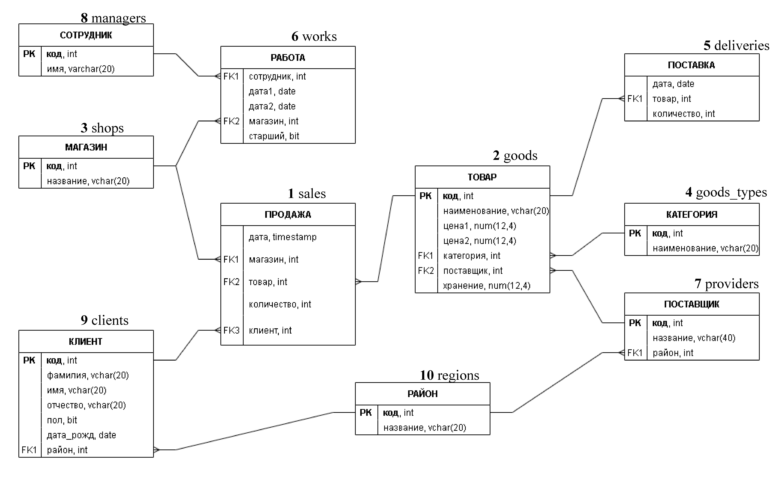

# 🗄️ ПАБД — база данных SALES


Лабораторные работы по дисциплине **«Программирование и администрирование баз данных»** (5 семестр) на учебной базе торговой организации **SALES**: PostgreSQL в локальной сети, объёмная БД и индексы, пользовательские типы, резервное копирование, функции на C, перенос в MS SQL Server, представления и функции T-SQL.

Все работы выполнены для **двух вариантов — 20 и 22** — и проверены прогоном на реальных серверах (PostgreSQL 18.6, SQL Server 2019 LocalDB).

---

## 📋 Содержание

| ЛР | Тема | Каталог | Главное |
|----|------|---------|---------|
| 1 | Сервер PostgreSQL в локальной сети Windows | [`DATA`](DATA), [`tasks`](tasks), `s*.bat` | БД `sales`, 2 задания × 2 варианта с параметрами |
| 2 | Временные характеристики запросов в объёмной БД | [`lab2`](lab2) | 2 млн записей, `CURRENT_TIME` / `\timing`, btree/hash, `EXPLAIN ANALYZE`, протоколы |
| 3 | Пользовательские типы данных | [`lab3`](lab3) | в.20 — трёхмерный вектор, в.22 — рациональное число |
| 4 | Резервное копирование и восстановление | [`lab4`](lab4) | `pg_dump` → файл / rar / многотомный rar, проверка `fc` |
| 5 | Функции пользователя на C | [`lab5`](lab5) | в.20 — `floor`, `ALLTRIM`; в.22 — `cosd`, позиция подстроки |
| 6 | Копирование БД из PostgreSQL в MS SQL Server | [`lab6`](lab6) | `pg_dump` + `sel2.exe` + `BULK INSERT`, задания на T-SQL |
| 7 | Представления и функции в MS SQL Server | [`lab7`](lab7) | премия сотрудников, затраты на хранение товара |

## 🧩 Схема базы SALES



`РАЙОН`, `КАТЕГОРИЯ`, `ПОСТАВЩИК`, `ТОВАР`, `МАГАЗИН`, `СОТРУДНИК`, `КЛИЕНТ` — справочники; `РАБОТА` — смены сотрудников в магазинах; `ПОСТАВКА` и `ПРОДАЖА` — движение товаров.

## 🎯 Индивидуальные задания

| | Вариант 20 | Вариант 22 |
|---|---|---|
| **ЛР1, задание 1** | объём поставок в ден. выражении по *категории товара* и *кварталу*, [21.08.2020, 20.08.2023] | выручка по *поставщику* и *декаде месяца*, [01.07.2019, 30.06.2023] |
| **ЛР1, задание 2** | количество проданных товаров по *дню недели* и *району поставщика*, [2019, 2023] | затраты клиентов по *времени года* и *полу клиента*, [2018, 2022] |
| **ЛР2** справочник | `ТОВАР` | `МАГАЗИН` |
| **ЛР3** (k = mod15(K−1)+1) | 5 — трёхмерный вектор | 7 — рациональное число (double) |
| **ЛР5** f1 / f2 | `floor(x)` / `ALLTRIM(s)` | `cosd(x)` / номер символа вхождения `s1` в `s` |
| **ЛР6** | задания ЛР1 на T-SQL | задания ЛР1 на T-SQL |

## 🚀 Быстрый старт

Нужны PostgreSQL 18 (`psql` в `PATH`), Git Bash; для ЛР5 — MS Visual Studio 2022, для ЛР4 — WinRAR, для ЛР6–7 — SQL Server (LocalDB или Express).

```bash
./h                 # список всех команд
./h db              # создать БД sales и загрузить данные ЛР1
./h v20 1           # вариант 20, задание 1 с параметрами по умолчанию
./h v22 2 2019 2021 лето
```

Скрипт [`h`](h) — единая точка запуска всех работ из Git Bash. Параметры с кириллицей передаются в psql через stdin (`\set`), поэтому не ломаются из-за CP1251 в командной строке Windows. То же самое доступно из `cmd` через командные файлы:

```bat
s1.bat DATA\create_DB
s.bat DATA\create_tables
s.bat DATA\load_data
s.bat tasks\v20_task1.sql 21.08.2020 20.08.2023 мебель
```

<details>
<summary><b>Все команды <code>./h</code></b></summary>

| Команда | Действие |
|---|---|
| `./h v20\|v22 1\|2 [a1 a2 a3]` | задание ЛР1 (период и значение признака 1) |
| `./h all` | все 4 задания ЛР1 |
| `./h lr2 gen [N]` / `restore` / `tbs` | генерация 2 млн продаж / данные ЛР1 / табличное пространство |
| `./h lr2 time\|timing 20\|22` | время запроса (*): `CURRENT_TIME` / `\timing on` |
| `./h lr2 idx\|idx1\|idx0\|pk1\|pk0\|copy 20\|22` | индексы и ключ таблицы-справочника |
| `./h lr2 explain 20\|22 [1]` / `measure 20\|22` | `EXPLAIN ANALYZE` / протокол замеров |
| `./h lr3 cmplx\|20\|22` | пользовательские типы |
| `./h lr4 all` | копирование и восстановление, пп. 1–10 |
| `./h lr5 build 20\|22` / `./h lr5 20\|22` | сборка DLL / демонстрация функций на C |
| `./h lr6 setup\|sel2\|createdb\|copy\|disp` | перенос базы в MS SQL Server |
| `./h lr6 v20\|v22 1\|2 [...]` | задания варианта на T-SQL |
| `./h lr7 create` / `1 D1 D2 P M [N]` / `2 D1 D2 α [G]` | премия / затраты на хранение |

</details>

## 📊 Результаты

### ЛР2 — объёмная БД

`ПРОДАЖА` — 2 000 000 записей (100 MB), вынесена в табличное пространство на диске D:. Время запроса (*): **≈4.7 с** (в.20), **≈6.5 с** (в.22) — в требуемом диапазоне 0.5–10 с.
Полные протоколы по всем сочетаниям индексов (btree / hash / нет × PRIMARY KEY / нет × с WHERE / без):
[`results/lr2_v20_results.txt`](results/lr2_v20_results.txt), [`results/lr2_v22_results.txt`](results/lr2_v22_results.txt).

Выводы:
- **в.20** (`WHERE ТОВАР.категория = 1` — половина товаров): условие отбирает половину строк, поэтому индексы по полю-ссылке на время практически не влияют (≈1.8 с без условия, ≈1.2 с с условием);
- **в.22** (`WHERE МАГАЗИН.название = 'Весна'` — 1 магазин из 5): btree-индекс по `ПРОДАЖА.магазин` даёт лучшее время — **344 мс** против 467 мс без индекса;
- без PRIMARY KEY справочника растёт оценка стоимости (cost), т.к. планировщик не знает об уникальности ключа;
- hash-индекс по полю с 5–10 различными значениями строится очень долго (несколько минут на 2 млн строк) из-за длинных цепочек переполнения — для таких полей он непригоден.

### ЛР4 — резервное копирование

| Файл | Размер |
|---|---|
| `base_save` (текст) | 48 741 байт |
| `base_rar.rar` | 14 674 байт |
| `base_rarM.part1.rar` + `part2.rar` | 8 192 + 6 647 байт |

Результаты контрольных задач после восстановления из текстового дампа и из rar-архива совпадают с исходными (`fc: no differences encountered`) — [`results/lr4_protocol.txt`](results/lr4_protocol.txt).

### ЛР5 — функции на C

Обе библиотеки (`v20.dll`, `v22.dll`) собираются MSVC 2022 из двух независимых `.c`-файлов; результаты функций на таблице T совпадают со встроенными `floor`, `btrim`, `cosd`, `position`. STRICT-функции возвращают NULL для NULL-аргументов без вызова кода на C.

### ЛР6 — перенос в MS SQL Server

Все 10 таблиц скопированы с тем же числом строк (`ПРОДАЖА` — 1000, `ПОСТАВКА` — 352, …); результаты всех четырёх заданий на T-SQL совпадают с PostgreSQL — [`results/lr6_results.txt`](results/lr6_results.txt).

### ЛР7 — премия и затраты на хранение

| Проверка | Результат |
|---|---|
| премия за весь период, P = 10 %, M = 10 % | **59 206.10** — совпадает с эталоном из примера преподавателя (`bonus3`) |
| `calculate1 01.01.2021 30.06.2021 8.5 10.5` | 4 135.67 (Андрей — 714.34) |
| `calculate2 01.01.2021 30.06.2021 0.5 плащ` | 1 051.10 — совпадает с независимым расчётом в PostgreSQL |

Остатки товаров по формуле (11) нигде не становятся отрицательными, т.е. данные удовлетворяют условию (5) модели. Все прогоны — [`results/lr7_results.txt`](results/lr7_results.txt).

## 📁 Структура

```
DATA/            создание БД sales, таблиц, загрузка данных (SOURCE - исходные данные)
tasks/           ЛР1: задания вариантов 20 и 22 (psql, параметры arg1..arg3)
helper/          общие сценарии: параметры, подсчёт строк, fixenc.pl (кодировка вывода)
lab2/ ... lab7/  лабораторные работы 2-7
results/         протоколы измерений и результаты
s0.bat s1.bat s.bat   консоль psql / сценарий в БД postgres / сценарий в БД sales
h                запуск всех задач из Git Bash
```

## ⚙️ Особенности окружения

- Кириллица: `psql` под Windows получает аргументы командной строки в CP1251, поэтому параметры передаются через stdin; служебные сообщения psql приводятся к UTF-8 фильтром [`helper/fixenc.pl`](helper/fixenc.pl).
- Служба PostgreSQL работает от `NETWORK SERVICE` и не читает файлы из профиля пользователя — DLL из ЛР5 копируются в `D:\PG_DLL`.
- База SALES в MS SQL Server создаётся с сортировкой `Cyrillic_General_CI_AS`, данные передаются в CP1251 (`BULK INSERT ... CODEPAGE = '1251'`).
- Для работы в локальной сети в `s*.bat` и `lab6/config.bat` достаточно заменить `localhost` / `(localdb)` на IP-адрес сервера.
